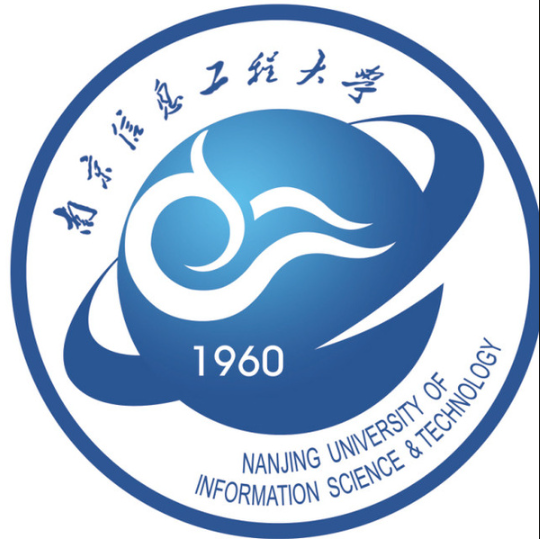

  

## Hello, here is Xuhaoyang

I am a Data Science postgraduate student in the UK, currently building a stronger foundation in Python, data analysis, machine learning, and AI-assisted coding workflows.

我是一名在英国学习 Data Science 的研究生，目前正在系统提升 Python、数据分析、机器学习和 AI 辅助编程能力。

- Current focus: Python fundamentals, data analysis, machine learning, and reproducible projects
- 当前重点：Python 基础、数据分析、机器学习、可复现项目
- Workflow: Codex + Cursor + Claude for learning, review, and implementation feedback
- 工作流：使用 Codex、Cursor、Claude 辅助学习、审查和实现反馈

 

## Study Experience

<table>
<tr><td>

- [University of Bristol](https://www.bristol.ac.uk/) &emsp; 2025-09-01 — Now

  - Programme: Data Science
  - Status: Postgraduate student in the UK
  - Focus: Python, data analysis, machine learning, and AI-assisted coding

 

- [Nanjing University of Information Science & Technology](https://www.nuist.edu.cn/) &emsp; 2021-09-01 — 2025-07-01

  - Programme: Data Science
  - Track: Sino-foreign cooperative programme
  - Focus: Data Science foundations and applied computing

 

- [University of Reading](https://www.reading.ac.uk/) &emsp; 2024-09-01 — 2025-07-01

  - Programme: Final-year UK study through the Sino-foreign cooperative programme
  - Focus: Data Science
  - Experience: Academic study and project work in the UK

</td></tr>
</table>

 

## Tech Stack

 

## Current Growth

I am currently working on a learning path that connects daily coding practice with portfolio projects.

我现在的学习路线，是把日常代码训练和可展示的作品集项目连接起来。

- Building Python fundamentals through structured practice
- Practicing data analysis workflows with notebooks and scripts
- Learning to review code, read tracebacks, and write clearer project documentation
- Exploring an AI coding workflow with Codex, Cursor, Claude, Obsidian, and GitHub

 

## Projects

My projects are still being built and refined. I prefer to keep this section focused and update it when a project becomes clear enough to represent my current skill level.

我的项目还在持续完善中。这个区域会保持克制，只展示真正能代表当前能力的项目。

 

## GitHub Stats

  
  

 

## Contact

- Email: [XuhaoyangChen@gmail.com](mailto:XuhaoyangChen@gmail.com)
- GitHub: [Dmosen-Chen](https://github.com/Dmosen-Chen)

